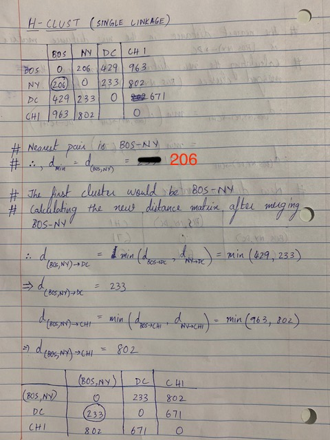
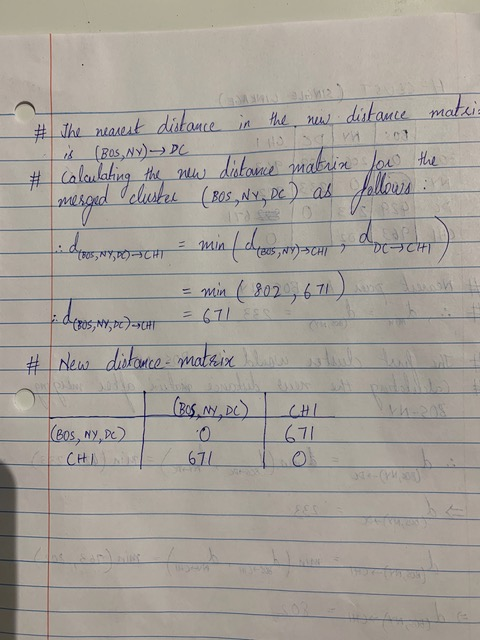

> Please submit your answers by 5.59 pm Monday March 4, 2019


## Question 1: Prediction using Logistic Regression
We are going to perform perdiction on a voting dataset (files->assignments->assignment_4). The dataset contains the  party affliation of 435 congressional members along with voting record on 16 issues that were put to vote in a single year. The party affliation is indicated as a binary variable as a 1 if the congress-person was a member of the 'A' party and 0 otherwise. The vote is indicated as 1 (if the member voted yes) and 0 (if ithe member voted no).

a) You will notice that the class-split is fairly even in the dataset.

0 : 168 members
1 : 267 members

Using caret, create a rough 80-20 split of the dataset into training and testing. In other words, 80% of the data should comprise the training dataset and 20% of the data should comprise the testing dataset. Ensure that the class membership is even (in other words, the proportion of 1 and 0 in both training and testing should be the approximately the same)


```{r message=FALSE}
# Attaching packages
library(caret)
library(pROC)
library(readr)
library(plyr)
library(dplyr)
library(jpeg)

```

NOTE: Set the seed to 476

```{r message=FALSE}
#Load dataset
d.vote <- read_csv("data_votes.csv") 

#Check for NA values
d.vote = na.omit(d.vote)
```


```{r}
set.seed(476)
trainIndex <- createDataPartition(d.vote$party_A, p = 0.8, times = 1, list = FALSE)
d.train <- d.vote[trainIndex,]
d.test  <- d.vote[-trainIndex,]


```

b) Perform a logistic regression (using glm) on the training dataset and perform a prediction on the test dataset. 

```{r}
#GLM
glm.out <- glm(d.train, formula = party_A ~., family = "binomial")
d.test$pred_A <- predict.glm(glm.out, newdata = d.test, type = "response")


```


c) Fill the confusion matrix below using your predictions. Consider outcome 1 as being "positive" and a probability cutoff of 0.5 (i.e. if probability >= 0.5, assign the label 1). 

```{r}
#Assigning Class Labels
d.test$pred_A <- ifelse(d.test$pred_A >= 0.5, 1, 0)
#d.test <- d.test %>%  mutate(pred_A = as.factor(pred_A))


```

Table        |  Actual_positive | Actual_negative
-------------|------------------|----------------
Pred_positive|        29        |       4
Pred_negative|        2         |       52
  
  
d) Calculate the following: Sensitivity, Specificity, Positive Predictive Value, Negative Predictive Value, False Positive Rate, and Accuracy.

```{r, echo=FALSE}
#Forming the confusion matrix
x<- confusionMatrix(table(d.test$pred_A, d.test$party_A, dnn = c("Predicted", "Actual")))
x
cat("The Sensitivity is",x$byClass["Sensitivity"], "\n")
cat("The Specificity is",x$byClass["Specificity"], "\n")
cat( "The Positive Predictive Value is", x$byClass["Pos Pred Value"], "\n")
cat( "The Positive Predictive Value is", x$byClass["Neg Pred Value"], "\n")
cat("The Accuracy is",x$overall["Accuracy"], "\n")
cat("The False Positvive Rate is",1 - x$byClass["Specificity"], "\n")

```

e) Calculate AUC (with 95% CI) using predicted probabilities

```{r}
# Changing class labels back to probabilities
d.test$pred_A <- predict.glm(glm.out, newdata = d.test, type = "response")
# Create a prediction object
pred <- roc(response = d.test$party_A, predictor = d.test$pred_A, direction = "<")
# Get AUC performance
auc_perf <- auc(pred) 
auc_perf
# Get 95% CI
ci_auc_perf <- ci.auc(pred) 
ci_auc_perf

```

## Question 2: Cross-validation
Write a program that will perform 3-fold cross-validation (using the caret package) on the above train dataset. Calculate AUC (with 95% CI) on the test dataset. 

NOTE : Set your seed as 156

```{r warning=FALSE, message=FALSE}
#Set Seed.
set.seed(156)
# Training using GLM
# 3-fold CV
training_params <- trainControl(method="cv", number = 3)
m.train.glm <- train(as.factor(party_A) ~ ., data = d.train, method = "glm", trControl = training_params)
m.train.glm

#summary(m.train.glm)


yhat_glm <- predict(m.train.glm, newdata = d.test, type = "prob")
# Create a prediction object
glm.pred <- roc(predictor = yhat_glm[,2], response = d.test$party_A, direction = "<")
# Get performance
auc.perf <- auc(glm.pred) 
ci.auc.perf <- ci.auc(glm.pred)
auc.perf
ci.auc.perf


```


## Question 3: Hierarchical clustering
We are going to use the USArrests dataset. Load this using the following command 
```{r}
d.in <- data.frame(USArrests)
```

(a) Perform hierarchical clustering using average linkage and Euclidean distance. Write the code and show the plots below.

Ans.
```{r,message=FALSE, warning=FALSE}
#Calculate dist matrix and pass into hclust with average linkage as the method
mat_dist = dist(d.in, method = "euclidean")
hc.avg <- hclust(d = mat_dist, method = "average")
plot(hc.avg, main = "Average")


```

(b) Perform hierarchical clustering using complete linkage and Euclidean distance, after scaling the variables to have a standard deviation of one. Write the code and show the plots below. 
```{r}
#Calculate the scaled dist matrix and pass into hclust with comeplete linkage as the method
d.scaled <- scale(d.in)
dist_scaled <- dist(d.scaled)
hc.comp <- hclust(d = dist_scaled, method = "complete")

plot(hc.comp, main = "Complete")


```


## Question 4: K-means clustering
Download the dataset kmeans_data.csv (Files->Assignments->Assignment_4).  The dataset contains randomly generated 100 observations of 2 variables, viz., X1 and X2

(a) Plot X1 vs. X2 (i.e. X1 on the x-axis) as a scatter-plot. Write the code below.
```{r}
#Visualizing data
d.inn <- read_csv("kmeans_data.csv")
ggplot(d.inn, aes(x = X1, y = X2)) + geom_point()


```


(b) Perform a k-means clustering with $K$ = 3. Overlap the cluster labels on the scatter plot.
```{r}
#kmeans with 3 clusters
km.3 <- kmeans(x = d.inn, centers = 3, nstart = 1)
#Plotting clusters along with each of their centroids
centroids <- data.frame(cluster = factor(seq(1:3)), X1 = km.3$centers[,'X1'], X2 = km.3$centers[,'X2'])

p <- ggplot(d.inn, aes(x = X1, y = X2, color = as.factor(km.3$cluster))) + geom_point() 
p <- p + scale_color_discrete(name = "Clusters", breaks = c(1, 2,3), labels = c("Cluster 1", "Cluster 2", "Cluster 3"))
p + geom_point(data = centroids, mapping = aes(x = X1, y = X2, color = cluster), size = 10,pch = 13)
  


```


(c) Perform a k-means clustering with $K$ = 4. Overlap the cluster labels on the scatter plot.
```{r}
# Insert code 
km.4 <- kmeans(x = d.inn, centers = 4, nstart = 1)
#Plotting clusters along with each of their centroids
centroids_4 <- data.frame(cluster = factor(seq(1:4)), X1 = km.4$centers[,'X1'], X2 = km.4$centers[,'X2'])

p4 <- ggplot(d.inn, aes(x = X1, y = X2, colour = as.factor(km.4$cluster))) + geom_point() 
p4 <- p4 + scale_color_discrete(name = "Clusters", breaks = c(1, 2,3, 4), labels = c("Cluster 1", "Cluster 2", "Cluster 3", "Cluster 4")) 
p4 + geom_point(data = centroids_4, mapping = aes(x = X1, y = X2, color = cluster), size = 10,pch = 13) 

```

(d) Which is a better $K$?      
Ans. k=3


## Question 5: Similarity Metrics
You are given the the following distance matrix that describes the euclidean distance between cities.

Table     | BOS | NY  | DC  | CHI
----------|-----|-----|-----|-----
BOS       |  0  | 206 | 429 | 963
NY        | 206 |  0  | 233 | 802
DC        | 429 | 233 |  0  | 671
CHI       | 963 | 802 | 671 |  0

You are asked to perform a hierarchical clustering using single linkage. 

The nearest pair of cities is BOS and NY, at distance 206. 

(a) Re-calculate the distance-matrix based on the merged group BOS/NY. 

Ans. 

Table     | (BOS, NY) | DC  | CHI
----------|-----------|-----|-----
(BOS, NY) |     0     |  ?  |  ?
DC        |     ?     |  0  | 671
CHI       |     ?     | 671 |  0


```{r}
d_BOSNY_DC <- min(429,233)
d_BOSNY_DC
d_BOSNY_CHI <- min(963,802)
d_BOSNY_CHI
```
Table     | (BOS, NY) | DC  | CHI
----------|-----------|-----|-----
(BOS, NY) |      0    | 233 |  802
DC        |     233   |  0  |  671
CHI       |     802   | 671 |   0

                                                                   
(b) Perform hierarchical clustering manually on paper (not using R code) until you reach two clusters. Show step-wise distance matrix calculations.

Ans. 

```{r pressure, echo=FALSE, fig.cap="Part 1", out.width = '100%'}

```

```{r, echo=FALSE, fig.cap="Part 2", out.width = '100%'}

```


